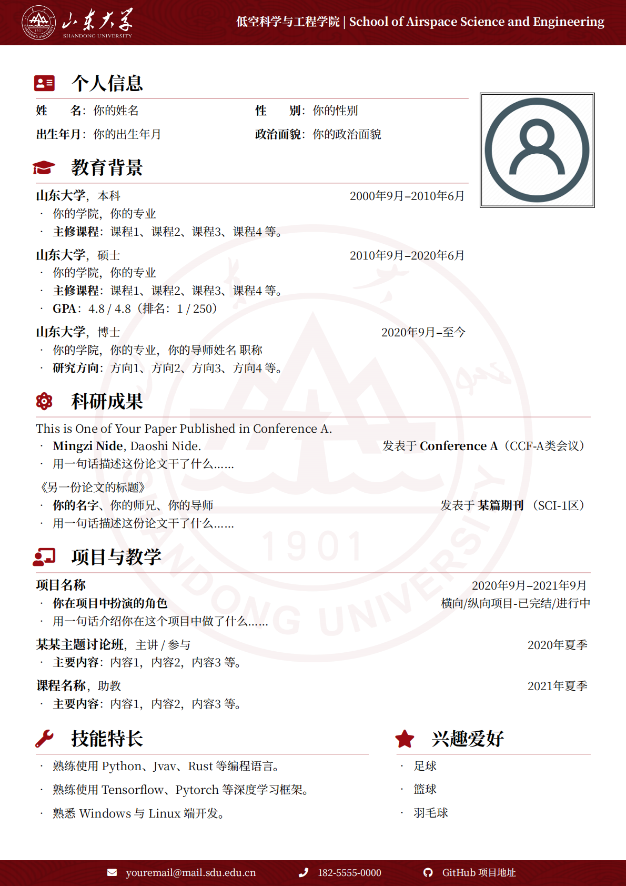

# SDU-CV：山东大学 LaTeX 中文简历模板

## 简介

基于 [SEU 中文 CV 模板](https://github.com/Exception0x0194/SEU-CV)进行修改

在原有内容的基础上修改了图标和颜色：

- 更改了校徽图标
- 更改了装饰图案的色彩风格

## 使用方法

- 编辑 `main.tex` 中的内容，对文档样式和内容进行修改。
- 使用 `XeLaTeX` 或 `LuaLaTeX` 编译。

## 致谢

感谢 [SEU 中文 CV 模板](https://github.com/Exception0x0194/SEU-CV)